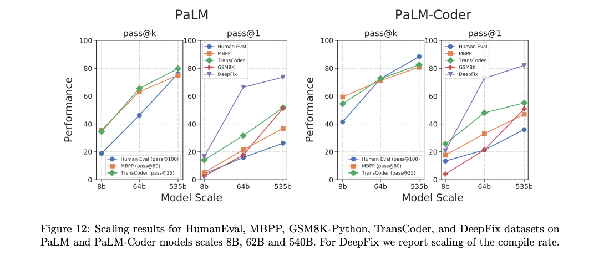

# 📘 Evaluation of Llama Models on the gsm8k-python Benchmark

Welcome! This repository dives deep into evaluations of the Llama and Code Llama models using the gsm8k-python dataset. We're building on some foundational research to bring you even more insights! 🧐

## 🌟 Key Features

### 1️⃣ Llama Performance on gsm8k-python

Jump into [llama_evals_gsm8k_python.ipynb](colabs/llama_evals_gsm8k_python.ipynb) to see how Llama models stack up against the gsm8k-python dataset. This dataset was introduced in the paper [PaLM: Scaling Language Modeling with Pathways](https://arxiv.org/abs/2204.02311).

### 2️⃣ gsm8k-python Prompt

We've put together the [gsm8k_python_prompt.py](data/gsm8k_python_prompt.py), a verbatim Python translation of the gsm8k-chain-of-thought prompt discussed in [Chain-of-Thought Prompting Elicits Reasoning in Large Language Models](https://arxiv.org/abs/2201.11903).

### 3️⃣ CodeLlama 7B and 13B Samples

🚀 Dive in to explore some samples from CodeLlama 7B and 13B models (target length: 256 tokens). Given the models' relatively small sizes, their capabilities might surprise you!

### 4️⃣ Insights and Extended Findings on Code Llama and gsm8k-python

Building on the [Code Llama paper](https://arxiv.org/abs/2308.12950), we've carried out additional evaluations on the `gsm8k-python` dataset. Below are the solve rates:

Original solve rates from the Code Llama paper:

| Model                  | Size  | Solve Rate |
|------------------------|-------|------------|
| Llama 2                | 7B    | 14.7%      |
| Llama 2                | 13B   | 24.2%      |
| Llama 2                | 34B   | 42.2%      |
| Llama 2                | 70B   | 56.5%      |
| Code Llama 7B          |       | 13.0%      |
| Code Llama 13B         |       | 20.8%      |
| Code Llama 34B         |       | 32.7%      |
| Code Llama - Python 7B |       | 13.0%      |
| Code Llama - Python 13B|       | 22.1%      |
| Code Llama - Python 34B|       | 34.4%      |

Our focused evaluations on the `gsm8k-python` dataset yielded:

| Model                       | Solve Rate |
|-----------------------------|------------|
| Code Llama - Python 7B      | **23.0%**   |
| Code Llama - Python 13B     | **34.5%**   |
| code-davinci-001            | 32.1%      |
| PaLM 540B                   | 51.3%      |

Boldfaced results are new; code-davinci-001 and PaLM 540B results are quoted from the [PaLM paper](https://arxiv.org/abs/2204.02311).

🔍 Some takeaways:
- Performance on `gsm8k-python` mirrors the `gsm8k` benchmark for traditional models, especially evident for Llama 2 7B and Llama 2 13B.
- Code-focused models, however, truly stand out on the `gsm8k-python` benchmark. The Code Llama checkpoints on `gsm8k-python` surpass their own `gsm8k` benchmarks, and also outshine the Llama 2 `gsm8k` benchmarks. A deeper dive is on its way!

## 🖼️ Scaling Results from PaLM Paper

The image below showcases the results from the [PaLM paper](https://arxiv.org/abs/2204.02311), specifically focusing on scaling gsm8k-python results acroos checkpoints of different sizes. 

## 🚀 Getting Started

Explore, experiment, and enjoy! Browse the repository for evaluations, prompts, and samples. Want to replicate our findings? Run the provided Jupyter Notebook. And for those who crave the nitty-gritty details, individual files and directories have got you covered.

## 📜 License

All this is shared under the [MIT License](LICENSE). Use wisely and have fun!
